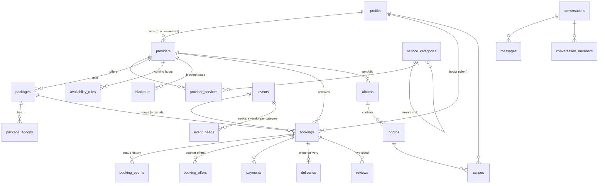

# Database & Auth Plan (Supabase)

**Status:** phases 0–2 **applied** to the hosted project on 2026-10-08 and passing a 22-check end-to-end test (`supabase/tests/smoke_test.sql`). Payments, deliveries and the multi-vendor planner tables come later. The open questions in section 8 were answered with the defaults below; change them with a new migration if you disagree.
**Project:** Supabase "Event Organizer" (`ktjvbajrfrbwpndforcy`, us-east-1, Postgres 17). It is currently empty.

**Goal:** launch with **photographers only**, while designing the schema so that adding **musicians, caterers, venues, makeup artists, florists** and an **event planner** later needs new rows and settings, not new tables or rewrites.

---

## 1. Key decisions

1. **One Supabase project (one Postgres database) for everything.** `architecture.md` proposes a database per service. At our size that adds cost and complexity without a payoff. We keep clear *table ownership* instead, so we can split later if we ever need to.
2. **Category-agnostic core.** Nothing is called `photographer_*`. A provider offers services in a **category**. Each category carries JSON Schemas that describe its own fields: photography packages have `edited_photos` and `turnaround_days`, while a caterer's will have `per_head_price` and `min_guests`. Adding a vertical means inserting rows, not writing a migration.
3. **Events exist from day one but stay optional.** `bookings.event_id` is nullable. Today a booking is a single photographer for a date. Later an **event** (a wedding, say) groups several bookings across categories and has a budget.
4. **Booking and payment state changes only go through database functions (RPCs) or server code**, never through direct `UPDATE`s from the app. That is how we enforce the state machine, the 48-hour expiry, and "no double-booking."
5. **Row-Level Security (RLS) is on for every table.** The app uses the publishable key. The service-role key lives only in server code (Edge Functions or FastAPI).
6. **Money is stored as integer cents** with a `currency` column, USD at launch.
7. **Migration files in Git are the source of truth.** No schema changes through the dashboard.

---

## 2. Authentication

| Item | Plan |
|---|---|
| Sign-in methods | Email (magic link / one-time code) + Google at launch. **Apple** is added before the iOS release (the App Store requires it whenever Google sign-in is offered). |
| User record | Supabase manages `auth.users`. A trigger (`handle_new_user`) creates our `profiles` row on signup with a generated username. |
| Roles | Everyone is a **client** by default. Becoming a **provider** means creating a `providers` row through the `become_provider()` RPC (onboarding). **Admins** are listed in an `admins` table and checked with `is_admin()`. Roles are never stored in user-editable metadata. |
| Identity verification | Stripe Identity runs server-side. A webhook writes `identity_verifications` and sets `providers.identity_verified`. We store **status only**, never ID images or face data. Providers must be verified to accept paid bookings. |
| Sessions | Supabase JWTs. Every RLS policy is written against `auth.uid()`. |
| Keys | Frontend: `VITE_SUPABASE_URL`, `VITE_SUPABASE_PUBLISHABLE_KEY` (safe to expose). Server only: `SUPABASE_SERVICE_ROLE_KEY` (Edge Function secrets / server `.env`, **never** committed or sent to the browser). |
| Account deletion | `delete_my_account()` RPC: anonymize the profile, cancel open requests, remove storage files, then delete the auth user. Required by Apple and Google. |

---

## 3. Data model

### 3.1 Overview

### 3.2 Identity & profiles

| Table | Key columns | Notes |
|---|---|---|
| `profiles` | `id` (= `auth.users.id`), `username` (citext, unique), `display_name`, `avatar_path`, `bio`, `city`, `location` (geography point), `client_rating_avg`, `client_rating_count`, `created_at` | Public read; owner edits. Ratings are maintained by a trigger. |
| `admins` | `user_id` | Read only through the `is_admin()` function. |
| `identity_verifications` | `user_id`, `vendor` (`stripe_identity`), `external_id`, `status`, `verified_at` | Owner reads; written by server code only. |

### 3.3 Categories (the multi-vendor backbone)

| Table | Key columns | Notes |
|---|---|---|
| `service_categories` | `id`, `slug`, `name`, `parent_id`, `kind` (`vertical` / `service`), `package_schema` (jsonb), `provider_schema` (jsonb), `is_active`, `sort_order` | Example tree: **Photography** → Wedding, Graduation, Portrait, Event, Headshots, Real estate, Product, Coaching, Meetups. Later: **Music** → DJ, Band…; **Catering**; **Venues**. |

`package_schema` and `provider_schema` are JSON Schemas. `pg_jsonschema` checks `packages.attributes` and `providers.attributes` against them.

### 3.4 Providers & offerings

| Table | Key columns | Notes |
|---|---|---|
| `providers` | `id`, `profile_id`, `vertical_id`, `display_name`, `slug`, `bio`, `base_location` (geography), `service_radius_km`, `travel_fee_per_km_cents`, `buffer_minutes`, `timezone`, `cancellation_policy_id`, `attributes` (jsonb, e.g. gear for photographers), `status` (`draft` / `active` / `suspended`), `identity_verified`, `is_pro`, `rating_avg`, `rating_count` | One profile may own several provider listings, one per vertical (`unique(profile_id, vertical_id)`). Public read when `active`. |
| `provider_private` | `provider_id`, `stripe_account_id`, `payouts_enabled` | Owner + server only. Kept out of the public table. |
| `provider_services` | `provider_id`, `category_id` | Which sub-services they offer (Wedding, Graduation…). |
| `cancellation_policies` | `id`, `name` (Flexible/Moderate/Strict/Custom), `rules` (jsonb tiers: days before → refund %), `provider_id` (null = shared template) | The policy is **snapshotted** onto each booking. |
| `packages` | `id`, `provider_id`, `category_id`, `name`, `description`, `price_type` (`fixed` / `hourly` / `quote`), `price_cents`, `currency`, `duration_minutes`, `deposit_pct`, `attributes` (jsonb, validated by the category's `package_schema`), `is_active`, `sort_order` | Photography `attributes`: `edited_photos`, `editing_level`, `turnaround_days`, `deliverables[]`. |
| `package_addons` | `id`, `provider_id`, `name`, `price_cents`, `is_active` | Extra hour, second shooter, rush delivery, prints. |

### 3.5 Availability

| Table | Key columns | Notes |
|---|---|---|
| `availability_rules` | `provider_id`, `weekday`, `start_time`, `end_time` | Working hours. |
| `blackouts` | `provider_id`, `during` (tstzrange), `reason` | Days the provider blocked off. |

"Who is free on these dates?" (the date search) is answered by an RPC, `search_providers(dates[], category, filters)`. It combines working hours, blackouts and active bookings, so the frontend never computes availability itself.

### 3.6 Events (multi-vendor; `events` + `event_members` exist now, the rest comes later)

| Table | Key columns | Notes |
|---|---|---|
| `events` | `id`, `owner_id`, `title`, `type` (wedding, birthday…), `starts_at`, `ends_at`, `location`, `guest_count`, `budget_cents`, `status` | A client's event. |
| `event_members` | `event_id`, `profile_id`, `role` (`owner` / `co_planner`) | Shared planning. |
| `event_members` | `event_id`, `profile_id`, `role` (`owner` / `co_planner`) | **Built.** The creator is added as owner automatically. |
| `event_needs` *(later)* | `id`, `event_id`, `category_id`, `budget_cents`, `status` (`open` / `requested` / `booked`), `booking_id` | "We need a photographer, a DJ and a caterer." |
| `event_plan_drafts` *(later)* | `event_id`, `version`, `plan` (jsonb), `created_by` (`user` / `ai`) | AI planner output. **Drafts only**; the AI never books or pays. |

### 3.7 Bookings (the core)

| Table | Key columns | Notes |
|---|---|---|
| `bookings` | `id`, `client_id`, `provider_id`, `package_id`, `category_id`, `event_id` (nullable), `status`, `time_range` (tstzrange), `timezone`, `location_text`, `location` (geography), `notes`, price snapshot (`subtotal_cents`, `addons_cents`, `travel_fee_cents`, `total_cents`, `deposit_cents`, `currency`), `package_snapshot` (jsonb), `policy_snapshot` (jsonb), `expires_at`, `created_at`, `updated_at` | **Exclusion constraint**: no two active bookings for the same provider can overlap in time. Read access is limited to the client and the provider. |
| `booking_addons` | `booking_id`, `addon_id`, `name`, `price_cents` | Snapshot of the add-ons chosen. |
| `booking_offers` | `id`, `booking_id`, `proposed_total_cents`, `message`, `status`, `created_by` | Counter offers. |
| `booking_events` | `id`, `booking_id`, `from_status`, `to_status`, `actor_id`, `note`, `created_at` | Append-only audit log of every status change. |

**Status flow** (matches the prototype):
`requested → (countered) → accepted → confirmed (deposit paid) → in_progress → delivered → completed`. The side branches are `declined`, `expired`, `cancelled_by_client`, `cancelled_by_provider`, `disputed` and `refunded`.

**RPCs** (security-definer functions; the only way to change status):

| RPC | What it does |
|---|---|
| `request_booking(package_id, dates[], addons[], location, notes)` | Creates one booking per date, which matches the multi-date request UI. |
| `respond_to_booking(id, 'accept' / 'decline' / 'counter', …)` | Provider responds. Accepting requires `identity_verified`. |
| `respond_to_offer(offer_id, accept)` | Client accepts or declines a counter offer. |
| `cancel_booking(id)` | Computes the refund from the policy snapshot. |
| `mark_delivered(id)` / `accept_delivery(id)` | Delivery handoff. |
| `open_dispute(id, reason)` | Freezes payout. |

`confirmed` is set **only** by the payment webhook (server code). A `pg_cron` job expires requests after 48 hours and auto-completes deliveries after 7 days.

### 3.8 Payments, deliveries, disputes *(tables in Phase 3; written only by server code)*

| Table | Key columns |
|---|---|
| `payments` | `booking_id`, `kind` (`deposit` / `balance` / `refund`), `amount_cents`, `stripe_payment_intent_id`, `status` |
| `payouts` | `booking_id`, `amount_cents`, `platform_fee_cents`, `stripe_transfer_id`, `status` |
| `stripe_events` | `id` (Stripe event id, PK). Records which webhooks were already handled, so a repeated webhook never runs twice. |
| `disputes`, `dispute_evidence` | `booking_id`, `opened_by`, `reason`, `status`, `resolution`; evidence file paths |
| `deliveries`, `delivery_files` | `booking_id`, `expires_at`; file paths, client favorites |

### 3.9 Reviews

| Table | Key columns | Notes |
|---|---|---|
| `reviews` | `id`, `booking_id`, `author_id`, `subject_id`, `direction` (`client_to_provider` / `provider_to_client`), `rating` (1–5), `body`, `created_at`, `revealed_at` | `unique(booking_id, direction)`. Allowed only when the booking is `completed` and within 14 days. **Double-blind**: `revealed_at` is set once both sides submit, or after 14 days (cron). Public read only after reveal. |

### 3.10 Portfolio (albums)

This matches the album viewer in the prototype. The tables are generic, so florists and venues can use them too.

| Table | Key columns | Notes |
|---|---|---|
| `albums` | `id`, `provider_id`, `category_id`, `title`, `caption`, `location_text`, `shot_on`, `kind` (`album` / `before_after`), `status` (`processing` / `published` / `under_review` / `hidden`), `cover_photo_id`, `sort_order`, `created_at` | Public read when `published`. |
| `photos` | `id`, `album_id`, `owner_id`, `position`, `original_path` (private), `display_path` (public, watermarked), `width`, `height`, `blurhash`, `pair_role` (`before` / `after`), `exif` (jsonb: body, lens, focal, aperture, shutter, iso, flash, taken_at), `exif_hidden` (text[]), `ai_score`, `authenticity` (`unverified` / `real_verified` / `flagged` / `ai`), `phash` | GPS is stripped before storage. |
| `tags`, `album_tags` | `slug`, `kind` (`genre` / `user` / `auto`) | |
| `photo_embeddings` *(Phase 2)* | `photo_id`, `embedding vector(512)` | Used by taste matching. |
| `ai_review_cases` *(Phase 2)* | `photo_id`, `raw_proof_path`, `status`, `reviewer_id` | The RAW file is deleted after review. |

### 3.11 Discovery, saving, social

| Table | Key columns | Notes |
|---|---|---|
| `swipes` | `id` (bigint), `user_id`, `photo_id`, `provider_id`, `action` (`like` / `pass` / `save`), `dwell_ms`, `position`, `session_id`, `reason_shown`, `created_at` | Append-only. Becomes training data for the future recommender. |
| `taste_corrections` | `user_id`, `kind` (`tag` / `provider`), `value`, `created_at` | "Not into this." |
| `saved_providers` | `user_id`, `provider_id` | The shortlist. |
| `collections`, `collection_items` | `owner_id`, `name`; `collection_id`, `photo_id` | |
| `follows` | `follower_id`, `provider_id` | |

### 3.12 Messaging, notifications, safety

| Table | Key columns | Notes |
|---|---|---|
| `conversations` | `id`, `kind` (`inquiry` / `booking` / `group` / `event`), `booking_id`, `event_id`, `created_at` | |
| `conversation_members` | `conversation_id`, `profile_id`, `last_read_at` | RLS: only members read or write. |
| `messages` | `id`, `conversation_id`, `sender_id`, `body`, `shared_album_id`, `created_at` | Realtime enabled. A `visible_body` column will be added later for contact masking. |
| `notifications` | `user_id`, `type`, `payload` (jsonb), `read_at` | |
| `reports`, `blocks` | `reporter_id`, `target_type`, `target_id`, `reason`, `status`; `blocker_id`, `blocked_id` | |

---

## 4. Row-Level Security summary

| Data | Who can read | Who can write |
|---|---|---|
| Profiles, active providers, active packages, published albums/photos, revealed reviews | Everyone (including logged-out visitors) | Owner only |
| `provider_private`, `identity_verifications` | Owner | Server only |
| Bookings, offers, booking history | The booking's client and provider | **RPCs only** |
| Payments, payouts, disputes | Booking parties | Server only |
| Conversations / messages | Members | Members (insert own messages) |
| Events, event needs | Owner + co-planners | Owner + co-planners |
| Swipes, corrections, saved providers, collections | Owner | Owner |
| Admin queues (reports, AI review) | Admins | Admins / server |

Every policy gets a **pgTAP test**. "A client can't read someone else's booking" and "a second overlapping booking is rejected" are tests, not assumptions.

---

## 5. Storage buckets

Paths start with the owner's user id (`{user_id}/…`), which lets storage policies check ownership.

| Bucket | Access | Contents |
|---|---|---|
| `avatars` | Public read, owner write | Profile pictures |
| `portfolio` | Public read, owner write | Display versions (resized, watermarked if enabled) |
| `portfolio-originals` | Private (owner) | Untouched originals, never served publicly |
| `deliveries` | Private (booking parties), signed URLs | Client galleries. Deleted at `expires_at` by cron |
| `raw-proofs` | Private (owner + admins) | RAW files for AI review. Deleted after review |
| `dispute-evidence` | Private (dispute parties + admins) | |

---

## 6. Rollout: migrations in order

Each step is one migration file in `supabase/migrations/`, reviewed in a pull request.

| Phase | Migration file (in `supabase/migrations/`) | Contents | Status |
|---|---|---|---|
| **0** | `20261008171959_extensions_and_profiles` | Extensions, shared enums, `profiles`, signup trigger, `admins`, `is_admin()`, `identity_verifications` | Applied |
| **1** | `20261008172117_categories_providers_packages` | `service_categories` (+ JSON schemas), `providers`, `provider_private`, `provider_services`, `cancellation_policies`, `packages`, `package_addons`, `become_provider()` | Applied |
| **1** | `20261008172131_availability` | `availability_rules`, `blackouts` | Applied |
| **1** | `20261008172231_portfolio_and_storage` | `albums`, `photos`, `tags`, `album_tags`, storage buckets + policies | Applied |
| **2** | `20261008172529_events_and_bookings` | `events`, `event_members`, `bookings` (no-overlap rule), add-ons, offers, history, booking RPCs, `search_providers()` / `is_provider_free()`, cron jobs | Applied |
| **2** | `20261008172715_messaging_reviews_discovery` | Conversations (+ auto booking threads), messages (Realtime), reviews + reveal, swipes, corrections, shortlist, collections, follows, notifications, reports, blocks | Applied |
| **2** | `20261008173740_hardening` | Trigger functions removed from the API, 21 foreign-key indexes | Applied |
| **2** | `supabase/pending/split_owner_policies.sql` | Optional performance tidy-up (split owner policies). Declined for now | Not applied |
| **3** | *(next)* `payments_deliveries` | Payments, payouts, stripe_events, disputes, deliveries + `deliveries` / `dispute-evidence` buckets, cleanup cron | When Stripe work starts |
| **Later** | | `event_needs` + `event_plan_drafts`, `photo_embeddings` (pgvector), `ai_review_cases`, Pro subscriptions, contact masking | |

**Seed data** (`supabase/seed.sql`):
- the Photography category tree with its JSON schemas
- the Flexible / Moderate / Strict policy templates
- (not yet) demo photographers, packages and albums from `frontend/src/data/mock.js`. These need real accounts, so they are best created by signing up test users once the app has sign-in.

After each migration we regenerate TypeScript types into `frontend/src/lib/database.types.ts`.

---

## 7. How we'll work with Supabase

**Tooling.** We use the Supabase CLI through `npx supabase` (no global install needed). Docker isn't installed, so we're on option A:

- **A. Hosted dev project only (start here).** Migrations live in Git and are applied to the "Event Organizer" project with `supabase db push`. No Docker needed. Downside: we share one database while developing.
- **B. Add local Supabase later.** Install Docker, then `supabase start` gives each of us a private local copy built from the same migrations. Worth doing once two people are changing schema at the same time.

**Setup: done**
- [x] `supabase/` created (`npx supabase init`), migrations + `seed.sql` + `tests/smoke_test.sql` committed
- [x] Migrations and seed applied to "Event Organizer" (`ktjvbajrfrbwpndforcy`)
- [x] `.gitignore` ignores `.env` and `.env.*` (except `.env.example`)
- [x] `frontend/.env.example` committed; `frontend/.env.local` holds the URL + publishable key (not committed)
- [x] `@supabase/supabase-js` installed; client in `frontend/src/lib/supabase.js`; types in `frontend/src/lib/database.types.ts`
- [ ] Invite Tim (Dashboard → Organization → Team)
- [ ] `npx supabase login` then `npx supabase link --project-ref ktjvbajrfrbwpndforcy` on each machine, so `db push` works

**Adding a schema change later**
1. `npx supabase migration new <name>` creates a timestamped file in `supabase/migrations/`.
2. Write the SQL, open a PR.
3. After review: `npx supabase db push` (applies only migrations the project hasn't run yet).
4. Regenerate types: `npx supabase gen types typescript --project-id ktjvbajrfrbwpndforcy > frontend/src/lib/database.types.ts`.
5. Run `supabase/tests/smoke_test.sql` in the SQL editor; every line should say `ok`.

**Rules:**
- Schema changes are made only through new migration files. Never edit a migration that has already been applied.
- One person runs `db push` per change, or a GitHub Action does it on merge to `main`.
- Never put the service-role key in the frontend, in Git, or in chat.

---

## 8. Open questions for Brian & Tim

1. **One database vs. one per service.** This plan uses one Supabase project. Tim, OK with you?
2. **Where does server logic live?** Supabase Edge Functions (TypeScript) for Stripe webhooks and notifications, and FastAPI only for ML (embeddings, AI-image detection)? Or FastAPI for all of it?
3. **Sign-in at launch.** Email + Google now and Apple before iOS. Agreed?
4. **Who can post albums?** This plan assumes **providers only**, given the provider-to-client focus. Clients get saves, collections and shortlists.
5. **Booking time model.** One booking = one continuous time range on one day. Multi-day jobs (a wedding weekend) are several bookings, which is how the multi-date request flow already works. OK?
6. **Currency.** USD only at launch?
